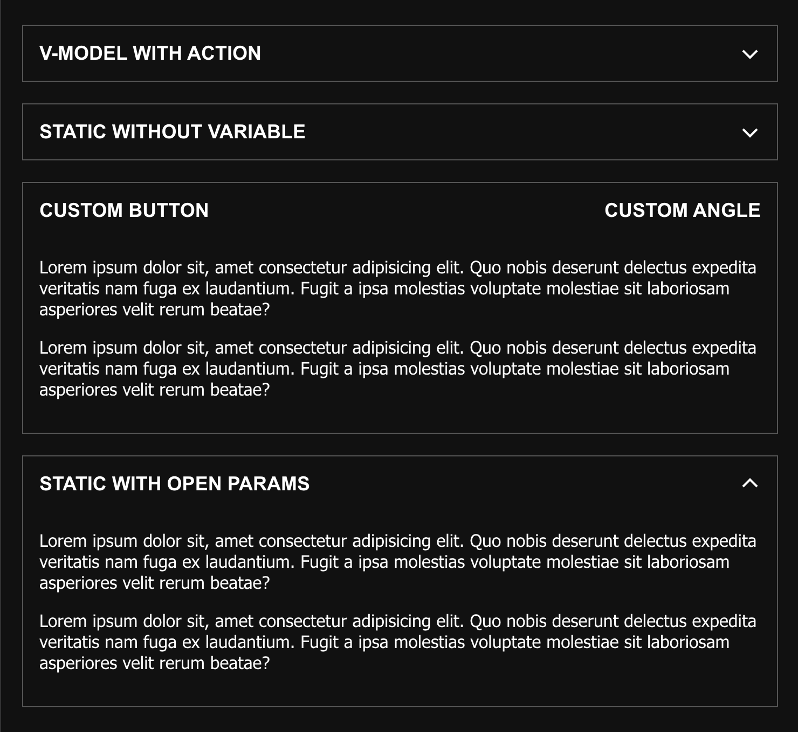

# Vue 3 and Nuxt 3 spoiler

Spoiler for vue3 and nuxtjs3, easy custom spoiler for hide/show blocks.



## Installing Vue3 and Nuxt 3
```js
import venSpoiler from '@venegrad/vue3-spoiler';

export default {
  components: {
    venSpoiler
  },
}
```


## Required CSS

You need it for open and close animation. You can controll speed of animation with `transition: height .25s ease;` in style.
```
.accordionitem-enter-active, .accordionitem-leave-active {
	will-change: height;
  transition: height .25s ease;
	overflow: hidden;
}

.accordionitem-enter-from, .accordionitem-leave-to {
	height: 0 !important;
	overflow: hidden;
}
```


Css if needed: 
```
@import '@venegrad/vue3-spoiler/dist/venSpoiler.css'
```

## Props

- `title`: (String/Number) (Optional)), Default = null, title string for spoiler
- `v-model`: (Boolean) (Optional), Default = false, reactive modelValue to open and close spoiler
- `open`: (Boolean), Default = false, variable to open 'static' spoiler without reactivity

## Events
All you need to do is attach a watch event to the v-model value, but if that's not enough for you, I've added a few more events.

- `@changed` =  return v-model open or close value
- `@open` =  return new Date() when spoiler is opened
- `@close` =  return new Date() when spoiler is closed

## Slots
- `Default` = elements for hidden block 
- `button` = (Optional) button inner  
- `angle` = (Optional) button angle  

See example below:

## Simple example
```html
<template>
	<section id="app" class="container">
		<ven-spoiler v-model="isOpen" @open="open" @close="close" @changed="changed" title="V-MODEL WITH ACTION">
			<p>Lorem ipsum dolor sit, amet consectetur adipisicing elit. Quo nobis deserunt delectus expedita veritatis nam fuga ex laudantium. Fugit a ipsa molestias voluptate molestiae sit laboriosam asperiores velit rerum beatae?</p>
			<p>Lorem ipsum dolor sit, amet consectetur adipisicing elit. Quo nobis deserunt delectus expedita veritatis nam fuga ex laudantium. Fugit a ipsa molestias voluptate molestiae sit laboriosam asperiores velit rerum beatae?</p>
		</ven-spoiler>

		<ven-spoiler title="STATIC WITHOUT VARIABLE">
			<p>Lorem ipsum dolor sit, amet consectetur adipisicing elit. Quo nobis deserunt delectus expedita veritatis nam fuga ex laudantium. Fugit a ipsa molestias voluptate molestiae sit laboriosam asperiores velit rerum beatae?</p>
			<p>Lorem ipsum dolor sit, amet consectetur adipisicing elit. Quo nobis deserunt delectus expedita veritatis nam fuga ex laudantium. Fugit a ipsa molestias voluptate molestiae sit laboriosam asperiores velit rerum beatae?</p>
		</ven-spoiler>

		<ven-spoiler :open="true">
			<template #button>
				<div>CUSTOM BUTTON</div>
			</template>
			<template #angle>
				<div>CUSTOM ANGLE</div>
			</template>
			<p>Lorem ipsum dolor sit, amet consectetur adipisicing elit. Quo nobis deserunt delectus expedita veritatis nam fuga ex laudantium. Fugit a ipsa molestias voluptate molestiae sit laboriosam asperiores velit rerum beatae?</p>
			<p>Lorem ipsum dolor sit, amet consectetur adipisicing elit. Quo nobis deserunt delectus expedita veritatis nam fuga ex laudantium. Fugit a ipsa molestias voluptate molestiae sit laboriosam asperiores velit rerum beatae?</p>
		</ven-spoiler>

		<ven-spoiler :open="true" title="STATIC WITH OPEN PARAMS">
			<p>Lorem ipsum dolor sit, amet consectetur adipisicing elit. Quo nobis deserunt delectus expedita veritatis nam fuga ex laudantium. Fugit a ipsa molestias voluptate molestiae sit laboriosam asperiores velit rerum beatae?</p>
			<p>Lorem ipsum dolor sit, amet consectetur adipisicing elit. Quo nobis deserunt delectus expedita veritatis nam fuga ex laudantium. Fugit a ipsa molestias voluptate molestiae sit laboriosam asperiores velit rerum beatae?</p>
		</ven-spoiler>

	</section>
</template>

<script setup>
import { ref } from 'vue';
import venSpoiler from '@venegrad/vue3-spoiler';

const isOpen = ref(false)
const open = val => alert('open')
const close = val => alert('closed')
const changed = val => alert(val)
</script>

<style>
.accordionitem-enter-active, .accordionitem-leave-active {
	will-change: height;
  transition: height .25s ease;
	overflow: hidden;
}

.accordionitem-enter-from, .accordionitem-leave-to {
	height: 0 !important;
	overflow: hidden;
}
</style>

```

## Help links: 
- If my solution was helpful to you, please give me a star on [Github](https://github.com/Venegrad/vue3-spoiler) or get my day better with: 
- USDT TRC20: `TKXybH3YoFvT5h8bQFLdkDBtiXA65y7xaB`
- USDT ERC20: `0xc3efeB4825E350eE5D6B032Aa1dE144B09B5bB0D`
